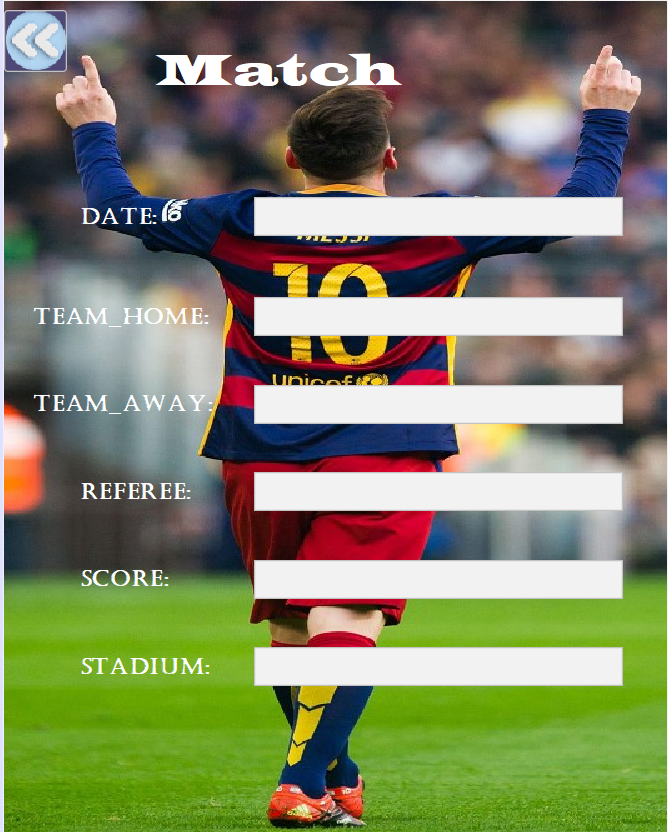
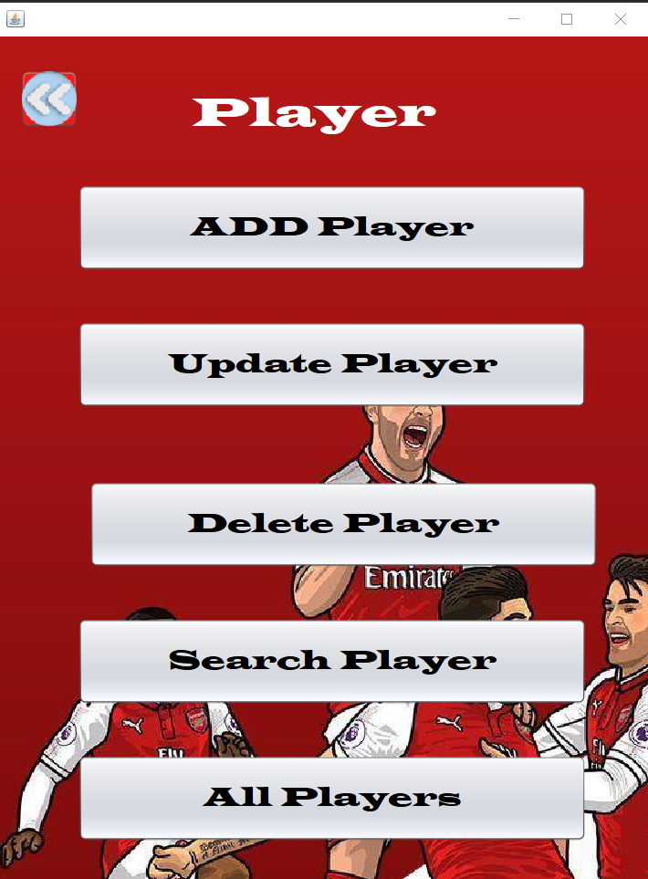
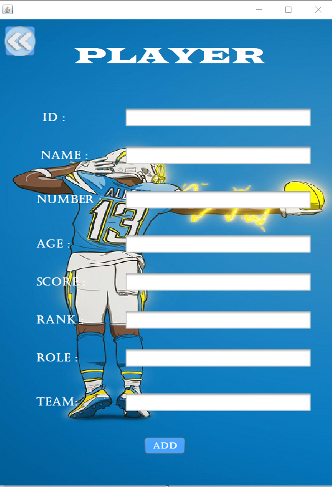
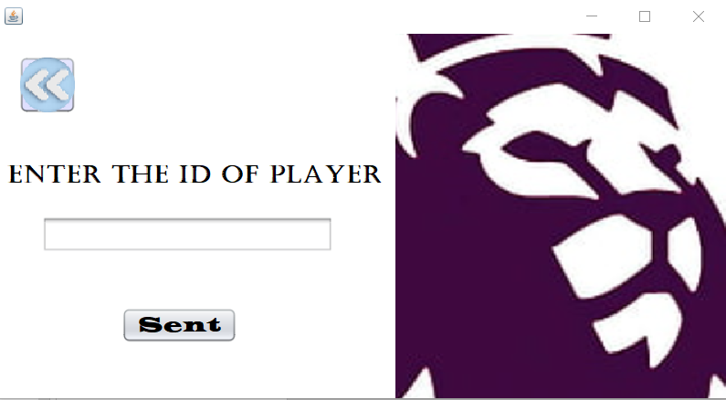
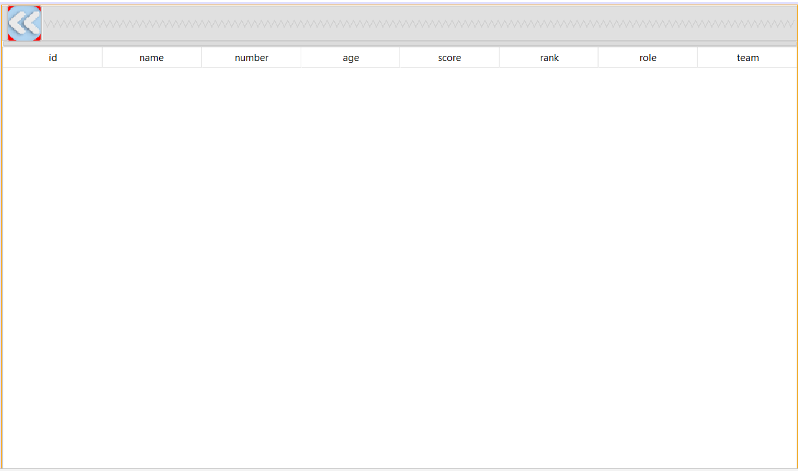

<!DOCTYPE html>
<html lang="en">
<head>
    <meta charset="UTF-8">
    <meta name="viewport" content="width=device-width, initial-scale=1.0">
</head>
<body>
    <h1>Egyptian League Project</h1>
    
The "Egyptian League" project was a Java-based application that I developed as part of my learning journey in software development. The goal of the project was to create a system for managing data related to the Egyptian football league.

    <h2>Project Features</h2>
    <ul>
        <li><strong>Object-Oriented Programming (OOP):</strong> I applied OOP principles to design and implement the various components of the application, such as teams, players, matches, and standings. This approach helped in creating modular and reusable code.</li>
        <li><strong>Database Integration:</strong> I utilized a relational database to store and manage data about teams, players, matches, and other relevant information. This allowed for efficient data storage, retrieval, and manipulation within the application.</li>
        <li><strong>User Interface (UI):</strong> While the primary focus of the project was on backend logic and data management, I also implemented a simple user interface using Java Swing or JavaFX to interact with the application and display information to users.</li>
        <li><strong>Data Persistence:</strong> To ensure that data remains persistent across sessions, I implemented features for data serialization and deserialization, enabling the application to save and load data from files or the database.</li>
        <li><strong>Error Handling and Validation:</strong> I implemented robust error handling mechanisms to handle exceptions and edge cases gracefully. Additionally, I incorporated data validation checks to ensure data integrity and prevent erroneous inputs.</li>
    </ul>
    <h2>Technologies Used</h2>
    
In developing the "Egyptian League" project, I utilized the following technologies:

    <ul>
        <li>Java: for the backend logic and application development.</li>
        <li>Object-Oriented Programming (OOP): for creating modular and maintainable code.</li>
        <li>Relational Database Management System (RDBMS): for data storage and management.</li>
        <li>IDE (Integrated Development Environment): such as IntelliJ IDEA or Eclipse for coding and project management.</li>
    </ul>
    
This project provided me with valuable hands-on experience in software development, particularly in Java programming, OOP principles, database integration, and user interface design.

  

    <h2 class="video-title">The Application</h2>

  
  
  
  
  
  

</body>
</html>
